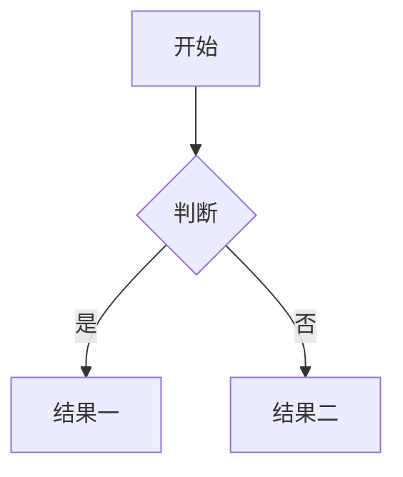
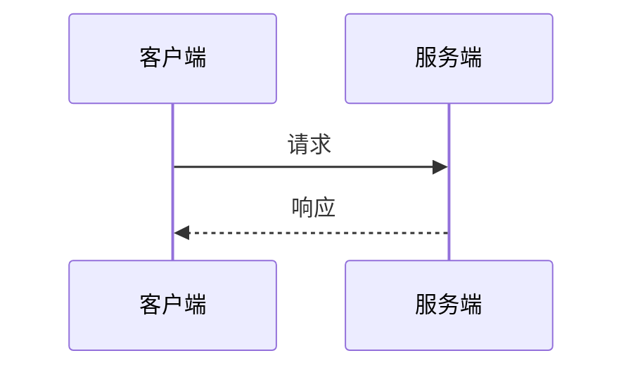

# 02 进阶组件

> 写作参考（本地），不会渲染到站点。这些是 Docusaurus 提供的组件，直接写在 Markdown 里即可。

## 提示框（Admonition）

提示框用于强调、警告、提示等场景，是文档中最常用的组件。

```markdown
:::note 普通提示
补充说明、注意事项。
:::

:::tip 小技巧
推荐做法、快捷方式。
:::

:::info 信息
需要读者知道的事实。
:::

:::warning 警告
可能造成问题的情况，谨慎处理。
:::

:::danger 危险
会导致严重后果的操作，务必确认。
:::
```

`note`/`tip`/`info`/`warning`/`danger` 后面的文字是自定义标题，也可省略标题只写类型。

## 标签页（Tabs）

同一内容的多语言或多平台示例用标签页切换：

```mdx
import Tabs from '@theme/Tabs';
import TabItem from '@theme/TabItem';

<Tabs>
  <TabItem value="java" label="Java">
    ```java
    // Java 示例代码
    ```
  </TabItem>
  <TabItem value="python" label="Python">
    ```python
    # Python 示例代码
    ```
  </TabItem>
</Tabs>
```

:::warning 注意
- Docusaurus 3 不再提供全局 MDX 组件，**必须在文件开头 import 上方两行**
- 使用 Tabs 的文件**必须保存为 `.mdx` 后缀**（`.md` 文件中组件不可用，会导致构建报错）
- `details` 等 HTML 标签同样需要 `.mdx` 后缀
:::

## 流程图（Mermaid）

```markdown

```

也支持时序图：

```markdown

```

## 折叠块（Details）

适合放长示例代码、历史说明等默认隐藏的内容：

```markdown
<details>
  <summary>点击展开查看完整示例</summary>

  这里是展开后的内容，支持 Markdown。

</details>
```

## 文档内跳转卡片

```markdown
- [用户认证接口](../api/user-auth) — 获取访问令牌
```

## 更多组件

Docusaurus 还提供 Infima 样式、代码高亮行（`// highlight-next-line`）等能力，需要时可查阅 Docusaurus 官方文档：[markdown-features](https://docusaurus.io/docs/markdown-features)

:::danger 常见报错：尖括号链接
MDX 语法下**不要**用 `<http://example.com>` 这种自动链接写法，会被解析成 JSX 标签导致构建报错。请一律写成 `[http://example.com](http://example.com)`。
:::
